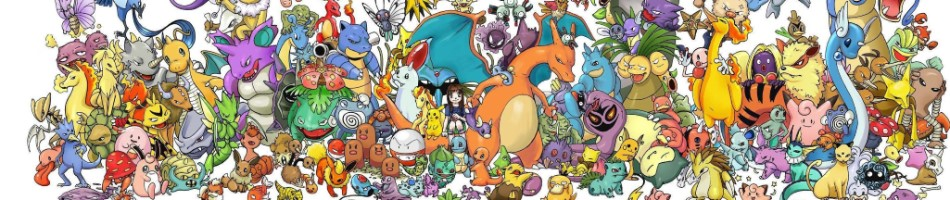

```{r include = FALSE, message = FALSE, warning = FALSE}
knitr::opts_chunk$set(echo = FALSE)
library("ggplot2")
library("reshape2")

pokemon <- read.csv("assets/pokedata.csv", na.strings = "")
palette <- c("#A6B91A", "#705746", "#6F35FC", "#F7D02C", "#D685AD", "#C22E28", "#EE8130", "#A98FF3", "#735797", "#7AC74C", "#E2BF65", "#96D9D6", "#A8A77A", "#A33EA1", "#F95587", "#B6A136", "#B7B7CE", "#6390F0")
```
##Introduction
***
The dataset I chose for my project was called *"Pokémon for Data Mining and Machine Learning"* which I found on [Kaggle](https://www.kaggle.com/alopez247/pokemon). I originally picked this dataset because it contained many variables, both categorical and quantitative, that I could attempt to correlate in a number of ways. In the end, however, I decided that I would set out to compare the numerous Pokémon types. Pokémon embody one to two "types" which, in part, determine that Pokémon's various stats, the moves it can use, and its appearance. There are currently eighteen types of Pokémon: Bug, Dark, Dragon, Electric, Fairy, Fighting, Fire, Flying, Ghost, Grass, Ground, Ice, Normal, Poison, Psychic, Rock, Steel, and Water.

In most Pokémon games, the player can only carry 6 Pokémon with him or her at one time, therefore it is always difficult to decide which Pokemon to bring along and which to leave behind; often times this decision is influenced by the Pokémon's type. It is always a good idea to maintain a diverse team of Pokémon and this analysis of the Pokémon types is designed to help players with just that.

##Pride And Prestige
```{r}
legendaries <- subset(pokemon, isLegendary == "True")
pokemelt <- na.omit(melt(legendaries, id.vars = "Name", measure.vars = c("Type_1", "Type_2")))
```
***
In the Pokémon universe there are a number of *Legendary Pokémon* that are significantly rarer and more powerful than the average Pokémon. In my data set of `r dim(pokemon)[1]` Pokémon, `r dim(legendaries)[1]` of them are legendary.

In order to deduce which type of Pokémon yields the most legendaries, I created a bar chart comparing the number of legendary Pokémon that belong to each type. Note that the total number of Pokémon shown in this bar graph is `r dim(pokemelt)[1]`, not `r dim(legendaries)[1]` because I am looking at both primary and secondary types. If a legendary is of the types Psychic and Flying, for example, it will be counted once for the Psychic type and once for the Flying type; effectively meaning that all Pokémon with two types are double counted. I chose to do this because I set out to compare what Pokémon you would have available should you commit yourself to a particular type. By including secondary types I am changing the overall counts of legendaries but when it comes to the individual types, I am fairly and completely representing all of the pokemon that have that type, even those who only have it secondarily.

```{r fig.width = 10}
bar <- ggplot(pokemelt, aes(x = value, fill = value))
bar <- bar + geom_bar() + scale_fill_manual(values=palette[c(-1, -14)])
bar <- bar + labs(title = "Count and Types of Legendary Pokemon", x = "Type", y = "Number of Pokemon")
bar <- bar + guides(fill = FALSE)
bar
```

From the data we can see that the Psychic type is the most legendary type; followed closely by Dragon, Flying, and Fire. Curiously there are no legendary Pokémon of either the Bug or Poison type. The three Pokémon that have the Fighting type possess it only as a secondary type.

If you are seeking prestige of legendary proportions, then the Psychic, Dragon, Flying, and Fire types may be for you. If, on the other hand, you are a fan of the Bug or Poison types, you will have to settle for a team without legendary Pokémon.

##Cold, Hard Stats
```{r}
typeTotal <- function(type) {
  pokemelt <- na.omit(melt(pokemon, id.vars = "Total", measure.vars = c("Type_1", "Type_2")))
  subset(pokemelt, value == type)[,1]
}

pokeattr <- colnames(pokemon)[5:11]

whiskerify <- function(attr) {
  pokemelt <- na.omit(melt(pokemon, id.vars = attr, measure.vars = c("Type_1", "Type_2")))

  box <- ggplot(pokemelt, aes_string(x = "value", y = attr, fill = "value"))
  box <- box + geom_boxplot() + scale_fill_manual(values=palette) + scale_x_discrete(name = "Type")
  box <- box + scale_y_continuous(name = paste(attr,"Stat"), breaks = seq(0, 1000, 25)) + guides(fill = FALSE)
  box <- box + ggtitle(paste("Pokemon", attr, "Stats by Type"))
  box
}

charts <- lapply(pokeattr, whiskerify)

pokemelt <- na.omit(melt(pokemon, id.vars = "Total", measure.vars = c("Type_1", "Type_2")))
```
***
If you couldn't care less about fame and legendary Pokémon and instead want only the strongest for your team, then you will want to know which Pokémon can deal the most damage, take the most hits, and respond the quickest. A Pokémon's combat abilities can be summarized by six numbers: HP, Attack, Special Attack (Sp_Atk), Defense, Special Defense (Sp_Def), and Speed. A Pokémon's overall combat rating is calculated by summing each of its six other stats.
I plotted the overall combat rating for all `r dim(pokemon)[1]` Pokémon in a histogram and showed the type distributions using different colors. This histogram can be used to see the overall distribution of the Total stat before dividing the Pokémon by type.

```{r fig.width = 10}
hist <- ggplot(pokemelt, aes(x = Total, fill = value))
hist <- hist + geom_histogram(binwidth = 25) + scale_fill_manual(values=palette)
hist <- hist + labs(title = "Total Stat for All Pokemon Types", x = "Total Stat", y = "Number of Pokemon", fill = "Type")
hist
```

This data is very clearly multimodal and appears to have modes roughly every 100 steps on the x axis. This could potentially show that pokemon are designed to loosely fit into different classes of strength depending on their Total stat.
Also, for the curious among you, the strongest Pokémon by total stat is `r pokemon[order(pokemon$Total, decreasing = TRUE),][1,2]` and the weakest is `r pokemon[order(pokemon$Total),][1,2]`. Here is a summary table showing numerical information about the spread and the center of the Total stat.

| Minimum | Q1 | Median | Q3 | Maximum | Mean | SD |
|:-------:|:--:|:------:|:--:|:-------:|:----:|:--:|
| `r min(pokemon[,5])` | `r unname(quantile(pokemon[,5], 0.25))` | `r median(pokemon[,5])` | `r unname(quantile(pokemon[,5], 0.75))` | `r max(pokemon[,5])` | `r round(mean(pokemon[,5]))` | `r round(sd(pokemon[,5]))` |

As stated before, the histogram, regardless of the colors, was mainly intended to show the overall distribution of the Total stat, not the individual type distributions. For a clearer picture of the Total stat for each of the types individually, we can turn to a box-and-whisker plot.

```{r results = 'hide', fig.width = 10}
charts[1]
```

Here we can see that the Dragon type is by far the strongest overall type. While the single strongest Pokémon is a Normal type, the median Total stat for the Dragon type exceeds even the Q3 of most other Pokémon types. To see exactly how all of the other types stack up we can turn to another summary table.

| Type | Minimum | Q1 | Median | Q3 | Maximum | Mean | SD |
|:----:|:-------:|:--:|:------:|:--:|:-------:|:----:|:--:|
| Bug | `r min(typeTotal("Bug"))` | `r unname(quantile(typeTotal("Bug"), 0.25))` | `r median(typeTotal("Bug"))` | `r unname(quantile(typeTotal("Bug"), 0.75))` | `r max(typeTotal("Bug"))` | `r round(mean(typeTotal("Bug")))` | `r round(sd(typeTotal("Bug")))` |
| Dark | `r min(typeTotal("Dark"))` | `r unname(quantile(typeTotal("Dark"), 0.25))` | `r median(typeTotal("Dark"))` | `r unname(quantile(typeTotal("Dark"), 0.75))` | `r max(typeTotal("Dark"))` | `r round(mean(typeTotal("Dark")))` | `r round(sd(typeTotal("Dark")))` |
| Dragon | `r min(typeTotal("Dragon"))` | `r unname(quantile(typeTotal("Dragon"), 0.25))` | `r median(typeTotal("Dragon"))` | `r unname(quantile(typeTotal("Dragon"), 0.75))` | `r max(typeTotal("Dragon"))` | `r round(mean(typeTotal("Dragon")))` | `r round(sd(typeTotal("Dragon")))` |
| Electric | `r min(typeTotal("Electric"))` | `r unname(quantile(typeTotal("Electric"), 0.25))` | `r median(typeTotal("Electric"))` | `r unname(quantile(typeTotal("Electric"), 0.75))` | `r max(typeTotal("Electric"))` | `r round(mean(typeTotal("Electric")))` | `r round(sd(typeTotal("Electric")))` |
| Fairy | `r min(typeTotal("Fairy"))` | `r unname(quantile(typeTotal("Fairy"), 0.25))` | `r median(typeTotal("Fairy"))` | `r unname(quantile(typeTotal("Fairy"), 0.75))` | `r max(typeTotal("Fairy"))` | `r round(mean(typeTotal("Fairy")))` | `r round(sd(typeTotal("Fairy")))` |
| Fighting | `r min(typeTotal("Fighting"))` | `r unname(quantile(typeTotal("Fighting"), 0.25))` | `r median(typeTotal("Fighting"))` | `r unname(quantile(typeTotal("Fighting"), 0.75))` | `r max(typeTotal("Fighting"))` | `r round(mean(typeTotal("Fighting")))` | `r round(sd(typeTotal("Fighting")))` |
| Fire | `r min(typeTotal("Fire"))` | `r unname(quantile(typeTotal("Fire"), 0.25))` | `r median(typeTotal("Fire"))` | `r unname(quantile(typeTotal("Fire"), 0.75))` | `r max(typeTotal("Fire"))` | `r round(mean(typeTotal("Fire")))` | `r round(sd(typeTotal("Fire")))` |
| Flying | `r min(typeTotal("Flying"))` | `r unname(quantile(typeTotal("Flying"), 0.25))` | `r median(typeTotal("Flying"))` | `r unname(quantile(typeTotal("Flying"), 0.75))` | `r max(typeTotal("Flying"))` | `r round(mean(typeTotal("Flying")))` | `r round(sd(typeTotal("Flying")))` |
| Ghost | `r min(typeTotal("Ghost"))` | `r unname(quantile(typeTotal("Ghost"), 0.25))` | `r median(typeTotal("Ghost"))` | `r unname(quantile(typeTotal("Ghost"), 0.75))` | `r max(typeTotal("Ghost"))` | `r round(mean(typeTotal("Ghost")))` | `r round(sd(typeTotal("Ghost")))` |
| Grass | `r min(typeTotal("Grass"))` | `r unname(quantile(typeTotal("Grass"), 0.25))` | `r median(typeTotal("Grass"))` | `r unname(quantile(typeTotal("Grass"), 0.75))` | `r max(typeTotal("Grass"))` | `r round(mean(typeTotal("Grass")))` | `r round(sd(typeTotal("Grass")))` |
| Ground | `r min(typeTotal("Ground"))` | `r unname(quantile(typeTotal("Ground"), 0.25))` | `r median(typeTotal("Ground"))` | `r unname(quantile(typeTotal("Ground"), 0.75))` | `r max(typeTotal("Ground"))` | `r round(mean(typeTotal("Ground")))` | `r round(sd(typeTotal("Ground")))` |
| Ice | `r min(typeTotal("Ice"))` | `r unname(quantile(typeTotal("Ice"), 0.25))` | `r median(typeTotal("Ice"))` | `r unname(quantile(typeTotal("Ice"), 0.75))` | `r max(typeTotal("Ice"))` | `r round(mean(typeTotal("Ice")))` | `r round(sd(typeTotal("Ice")))` |
| Normal | `r min(typeTotal("Normal"))` | `r unname(quantile(typeTotal("Normal"), 0.25))` | `r median(typeTotal("Normal"))` | `r unname(quantile(typeTotal("Normal"), 0.75))` | `r max(typeTotal("Normal"))` | `r round(mean(typeTotal("Normal")))` | `r round(sd(typeTotal("Normal")))` |
| Poison | `r min(typeTotal("Poison"))` | `r unname(quantile(typeTotal("Poison"), 0.25))` | `r median(typeTotal("Poison"))` | `r unname(quantile(typeTotal("Poison"), 0.75))` | `r max(typeTotal("Poison"))` | `r round(mean(typeTotal("Poison")))` | `r round(sd(typeTotal("Poison")))` |
| Psychic | `r min(typeTotal("Psychic"))` | `r unname(quantile(typeTotal("Psychic"), 0.25))` | `r median(typeTotal("Psychic"))` | `r unname(quantile(typeTotal("Psychic"), 0.75))` | `r max(typeTotal("Psychic"))` | `r round(mean(typeTotal("Psychic")))` | `r round(sd(typeTotal("Psychic")))` |
| Rock | `r min(typeTotal("Rock"))` | `r unname(quantile(typeTotal("Rock"), 0.25))` | `r median(typeTotal("Rock"))` | `r unname(quantile(typeTotal("Rock"), 0.75))` | `r max(typeTotal("Rock"))` | `r round(mean(typeTotal("Rock")))` | `r round(sd(typeTotal("Rock")))` |
| Steel | `r min(typeTotal("Steel"))` | `r unname(quantile(typeTotal("Steel"), 0.25))` | `r median(typeTotal("Steel"))` | `r unname(quantile(typeTotal("Steel"), 0.75))` | `r max(typeTotal("Steel"))` | `r round(mean(typeTotal("Steel")))` | `r round(sd(typeTotal("Steel")))` |
| Water | `r min(typeTotal("Water"))` | `r unname(quantile(typeTotal("Water"), 0.25))` | `r median(typeTotal("Water"))` | `r unname(quantile(typeTotal("Water"), 0.75))` | `r max(typeTotal("Water"))` | `r round(mean(typeTotal("Water")))` | `r round(sd(typeTotal("Water")))` |

But maybe you have a very particular fighting style and a couple stats in particular are important to you. Well fear not! Here are another six boxplots for each of the six separate Pokémon stats. First up is HP, the stat that determines how much damage your Pokémon can take before falling out of battle.

```{r results = 'hide', fig.width = 10}
charts[2]
```

As far as comparing Pokémon types go, this graph isn't the most fascinating. Most of the types are rather similar in terms of HP though it is reasonable to say that Ground type Pokémon have somewhat higher HP than normal and Ghost types somewhat lower. The Pokémon with the greatest amount of HP is `r pokemon[order(pokemon$HP, decreasing = TRUE),][1,2]` with `r sort(pokemon$HP, decreasing = TRUE)[1]` HP and the Pokémon with the least amount of HP is `r pokemon[order(pokemon$HP),][1,2]` with `r sort(pokemon$HP)[1]` HP.

Next up is the Attack stat which determines the amount of physical damage that a Pokémon can deal out. Think Tackle, Scratch, or other moves that involve physical contact.

```{r results = 'hide', fig.width = 10}
charts[3]
```

Predictably, the Fighting type has the highest median Attack stat but what is surprising is how closely the Fighting type is matched by the Dragon type. Both the Dragon and Fighting types are capable of dealing out major physical damage. The Pokémon with the highest Attack stat is `r pokemon[order(pokemon$Attack, decreasing = TRUE),][1,2]` with `r sort(pokemon$Attack, decreasing = TRUE)[1]` Attack and the two Pokémon with the lowest Attack stats are `r pokemon[order(pokemon$Attack),][1,2]` and `r pokemon[order(pokemon$Attack),][2,2]` with `r sort(pokemon$Attack)[1]` Attack each.

The Defense stat determines how much of an enemy's attack is resisted and how much of it drains HP. The higher the Defense stat, the more damage is resisted and the less HP is lost.

```{r results = 'hide', fig.width = 10}
charts[4]
```

Here the Rock and Steel types come out on top — their solid bodies able to resist the most amount of damage. Steel type Pokémon seem to vary less in the Defense stat than the Rock type. The Pokémon with the highest Defense stat is `r pokemon[order(pokemon$Defense, decreasing = TRUE),][1,2]` with `r sort(pokemon$Defense, decreasing = TRUE)[1]` Defense and the two Pokémon with the lowest Defense stats are `r pokemon[order(pokemon$Defense),][1,2]` and `r pokemon[order(pokemon$Defense),][2,2]` with `r sort(pokemon$Defense)[1]` Defense each.

While Attack and Defense pertain only to physical damage, Special Attack and Special Defense deal with non-physical damage like is dealt during moves like Inferno, Water Gun, or other elemental attacks. First we will look at the Special Attack stat.

```{r results = 'hide', fig.width = 10}
charts[5]
```

Special Attack is nearly a 4-way tie, but looking strictly at medians, the Psychic type comes out on top. The Psychic type is closely followed, however, by the Dragon, Electric, and Fire types. What these types may lack in the regular Attack stat, they make up for in Special Attack — particularly the Psychic type. The Pokémon with the highest Special Attack stat is `r pokemon[order(pokemon$Sp_Atk, decreasing = TRUE),][1,2]` with `r sort(pokemon$Sp_Atk, decreasing = TRUE)[1]` Special Attack and the three Pokémon with the lowest Special Attack stats are `r pokemon[order(pokemon$Sp_Atk),][1,2]`, `r pokemon[order(pokemon$Sp_Atk),][2,2]`, and `r pokemon[order(pokemon$Sp_Atk),][3,2]` with `r sort(pokemon$Sp_Atk)[1]` Special Attack each.

The ability to resist these non-physical, elemental attacks is determined by the Special Defense stat. It works the same way as the Defense stat, but applies to non-physical attacks.

```{r results = 'hide', fig.width = 10}
charts[6]
```

When it comes to Special Defense the Dragon type comes out on top; it just barely beats out the Psychic and Steel types. Amazingly there is a 5-way tie for the Pokémon with the lowest Special Defense. The Pokémon with the highest Special Defense stat is `r pokemon[order(pokemon$Sp_Def, decreasing = TRUE),][1,2]` with `r sort(pokemon$Sp_Def, decreasing = TRUE)[1]` Special Defense and the five Pokémon with the lowest Special Defense stats are `r pokemon[order(pokemon$Sp_Def),][1,2]`, `r pokemon[order(pokemon$Sp_Def),][2,2]`, `r pokemon[order(pokemon$Sp_Def),][3,2]`, `r pokemon[order(pokemon$Sp_Def),][4,2]`, and `r pokemon[order(pokemon$Sp_Def),][5,2]` with `r sort(pokemon$Sp_Def)[1]` Special Defense each.

Finally there is the Speed stat which is used to determine which Pokémon moves first in battle. The Pokémon with the higher speed always moves first.

```{r results = 'hide', fig.width = 10}
charts[7]
```

The fastest Pokémon type is the Electric type, handily beating all of the other types. The slowest overall type was the Rock type. The Pokémon with the highest Speed stat is `r pokemon[order(pokemon$Speed, decreasing = TRUE),][1,2]` with `r sort(pokemon$Speed, decreasing = TRUE)[1]` Speed and the two Pokémon with the lowest Speed stats are `r pokemon[order(pokemon$Speed),][1,2]` and `r pokemon[order(pokemon$Speed),][2,2]` with `r sort(pokemon$Speed)[1]` Speed each.

As can be seen from the data, different types are stronger in different stats. Depending on your personal battle strategy you may want to choose a type other than Dragon. Or maybe you aren't looking for the best of the best in a particular stat and are just looking for a type that is well rounded and has as few shortcomings as possible.

It should also be noted that Shuckle comes up a ridiculous number of times as either the strongest or weakest Pokémon in a particular stat. It also seems far more likely to tie for the lowest value in a particular stat than to tie for the highest value. Also, the Normal type seems to contain a particularly large number of outliers.

##So You've Fallen In Love With A Type, How Many New Friends Do You Have?
```{r}
pokemelt <- na.omit(melt(pokemon, id.var = "Name", measure.vars = c("Type_1", "Type_2")))
```
***

Now that you have decided what type of Pokémon will always be at your side, how many options do you have? Out of `r dim(pokemon)[1]` Pokémon, how many are your type? The following waffle chart shows how common each type of Pokémon is: every square represents one percent of the total Pokémon population.

```{r}
nrows <- 10
grid <- expand.grid(y = 1:nrows, x = 1:nrows)
counts <- rle(sort(pokemelt$value))
grid$type <- rep(counts[[2]], round(nrows^2 * (counts[[1]] / sum(counts[[1]]))))
waffle <- ggplot(grid, aes(x = x, y = y, fill = type))
waffle <- waffle + geom_tile(color = "white", size = 1) + scale_fill_manual(values = palette)
waffle <- waffle + labs(title = "Frequencies of Pokemon Types", fill = "Type")
waffle <- waffle + scale_y_continuous(trans = 'reverse') + coord_equal() + theme_void()
waffle
```

As can be seen from the waffle chart above, the most common type of Pokémon, by a significant margin, is the Water type — representing eleven percent of all Pokémon. Types such as Fairy, Ice, and Ghost are much more rare at only three percent of the population each. Does rarity add to the value of a Pokémon? Or only add to the frustration involved in finding it? That is for you to decide!

##Conclusion (Sorta)
With a dataset this big, there is far more to be explored! I do feel, however, that I have covered a good portion of the type-related variables. Overall the stats of Pokémon vary wildly, and the distribution of the Total stat, for example, is far from normal. The histogram most clearly shows the shape of this distribution as multimodal and with several outliers on the high-end.

Overall, it seems like the Dragon type is the best type. It has a high number of legendary Pokémon associated with it and it comes out on top in the Total stat and is a consistent leader in the other six stats as well. Its only drawback would be its relative rarity at only four percent of all Pokémon.

In the end, however, the choice of Pokémon is far more complicated than just looking at the types. In my analysis I failed to test for the most important Pokémon choosing factor: the cuteness factor. Oh well, perhaps someday statisticians will find a way to quantify "cuteness", but until then, I'll have to stick to my numbers.
